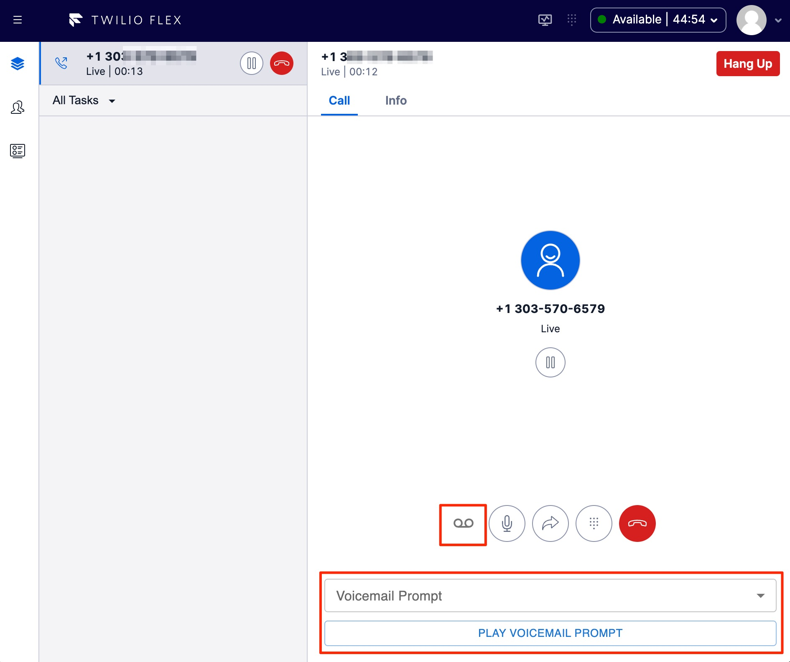

# Plugin Voicemail Prompts

This repository provides a simple illustration of sending an outbound SMS notification or creating a new SMS conversation.

This protoype Flex plugin offers two (2) options:

1. Click the "Voicemail" button to play a specific recorded prompt; and

2. Use the "Voicemail Prompt" select dropdown to choose a specific prompt to play.  This allows the user to choose what prompt is specific to the customer call.

> Note: For either of these options, the specific prompt (recording) or list of prompts (recordings) can be programatically set via AJAX queries with a remote application (e.g. CRM).


### Screenshots - UI Screenshot

The following image hightlight the architecture of this demonstation and the components above.




## Setup

The following steps are necessary to use this plugin package.  These are:

1. Plugin Serverless (serverlessVoicemail) - Setup & Configure
2. Flex Plugin (src) - Setup & Configure


### Plugin Serverless - Setup/Configure
This package is located within 'serverlessVlicemail'. Follow the README instructions inclusive to this package.

After setup and configuration, launch the serverless ( twilio serverless:start ) to run locally on port 3000.


### Flex Plugin - Setup and Configure

The following steps are necessary to configure and test the Flex Plugin found in `/src`.

1. Create the .env file and Configure
```sh
cp .env.example .env
```
Configure the environment constants.

2. Copy public/appConfig.example.js to appConfig.js, set your Flex accountSid within 'appConfig.js'

```sh
cp appConfig.example.js appConfig.js
```

3. Build the package dependencies.

```sh
npm i
```

4. Install necessary pre-requisites ( [Twilio CLI](https://www.twilio.com/docs/twilio-cli/getting-started/install), [Flex Plugins CLI](https://www.twilio.com/docs/flex/developer/plugins/cli) & [Twilio Serverless Toolkit](https://www.twilio.com/docs/labs/serverless-toolkit) )

5. From the CLI, Create a Twilio [account profile](https://www.twilio.com/docs/twilio-cli/general-usage/profiles) and mark it [active](https://www.twilio.com/docs/twilio-cli/general-usage/profiles#set-an-active-profile)


6. Launch the Flex Plugin

While logged into the Twilio Flex account via Twilio Console, launch the Flex Plugin on port 3001.

```sh
twilio flex:plugins:start
```

> Notes:  To test locally set the plugin ENV (.env) variable 'FLEX_APP_TWILIO_SERVERLESS_DOMAIN' to be the ngrok URI of your ngrok tunnel.

7. Deploy the Flex Plugin

    a. Deploy the Serverless package 

    ```sh
    cd serverlessVoicemail
    twilio serverless:deploy
    ```

    > Note: Capture the Twilio Serverless domain URI to update the Flex Plugin .ENV 

    b. Edit the Flex Plugin .ENV to change the 'FLEX_APP_TWILIO_SERVERLESS_DOMAIN' environment variable to the value of the Serverless domain URI.

    c. Use the following Twilio CLI command syntax to deploy the Flex plugin

    ```sh
    twilio flex:plugins:deploy --major --changelog "Notes for this version" --description "Functionality of the plugin"
    ```

    > Resource: [Deploy and Release Flex Plugins](https://www.twilio.com/docs/flex/developer/plugins/cli/deploy-and-release)
